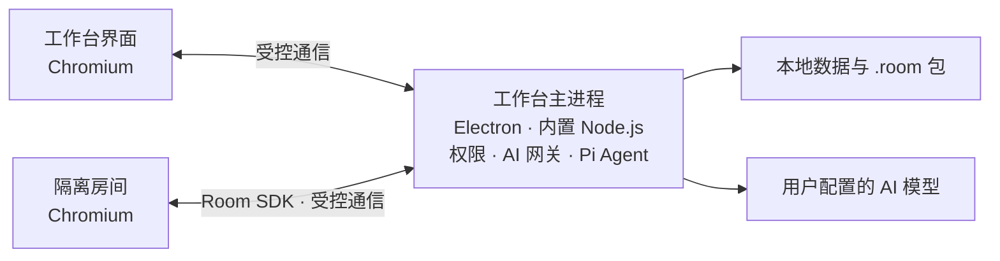

# 千万间 Roomillion

简体中文 | [English](README.en.md)

千万间是一个离线优先的桌面工作台。它让 AI 创建可安装、可修改、可分享的“房间”（小应用），用于办公、文档处理、数据整理和交互工具。房间通过工作台提供的受控接口使用文件、数据和 AI 能力；它们不能直接读取系统密钥或任意文件。

当前源码版本为 0.4.0。Windows x64 提供安装版、目录便携版和单文件便携版；generic Linux x64 提供技术预览。两种系统使用各自的工作台程序，但可以交换兼容的 .room 房间包。macOS 尚无可发布版本。项目仍处于技术预览阶段，Linux 预览不等于已通过指定 UOS 版本认证。

## 获取和运行

发行包发布后，请从对应版本的 GitHub Release 下载并核对随附的 SHA-256。GitHub 自动生成的“Source code”压缩包不是可运行程序。源码仓库不包含本机构建的 release/ 产物。

| 平台 | 产物 | 适用场景 |
| --- | --- | --- |
| Windows x64 | Roomillion-0.4.0-Setup.exe | 按当前用户安装，注册 .room 文件关联 |
| Windows x64 | Roomillion-0.4.0-Portable-Folder.zip | 解压即用，默认把数据放在解压目录 |
| Windows x64 | Roomillion-0.4.0-Portable.exe | 单文件便携版，默认使用当前用户数据目录 |
| Linux x64 | Roomillion-0.4.0-linux-x64.tar.xz、Roomillion-0.4.0-x86_64.AppImage | 通用 Linux 技术预览，仍需目标发行版实机验收 |

Windows 产物目前未签名。三种 Windows 包均不要求目标电脑预装 Node.js、Git、SQLite 或 npm 包。

目录便携版默认将工作台和房间数据保存在程序旁的 Roomillion-data/。单文件便携 EXE 首次启动时可选择数据位置；不选择则使用当前用户的数据目录。安装版也使用当前用户的数据目录。之后可以在“设置 → 房间位置”查看或更改位置。复制单文件 EXE 不会自动带走房间数据；跨电脑迁移可使用房间的“导出 → 应用＋数据”，在另一台电脑导入。API Key 由操作系统加密，换电脑后需要重新配置。

关闭工作台时可选择退出或常驻后台。后台模式会隐藏窗口，房间和 AI 任务继续运行，可从系统托盘恢复。

从源码运行（Node.js 22 或更新的兼容版本）：

    npm ci --cache .npm-cache
    npm run build:resources
    npm start

这些命令用于源码开发。安装发布包的用户无需另装 Node.js 或 npm。

## 架构概览

- **工作台主进程**运行在 Electron 自带的 Node.js 环境中，管理窗口、房间安装、权限、数据、文件、AI 网关和内置 Git。基于 Pi SDK 的房间开发 Agent 也在工作台中运行。
- **工作台界面与房间**运行在 Chromium 中。每个房间处于隔离的渲染环境，通过受控的 Room SDK 请求工作台能力，不能直接调用 Node.js、Electron 或读取密钥。
- **开发与交付**使用 Node.js、npm 和 electron-builder 构建工作台；发布包自带所需运行时。房间以 .room 包分发，共用工作台提供的官方模块。

## 房间与 AI 能力

工作台内置八个公开示例：物资台账、会议行动项、离线 3D 晶体挑战、AI 辩论场、AI 模型能力测试、千万间浏览器、文档浏览与转换、音频分析室。它们展示了数据库、文件导入导出、3D 交互、多模型协作、文档转换、音频分析和受控网页浏览。未公开示例不属于本仓库或发行包。

房间可以导出为 .room 文件，选择只包含应用，或同时包含应用和数据，并可设置密码。旧版 .zroom 仍可导入，新导出统一使用 .room。安装房间前，工作台会显示完整性、权限等预检结果。

AI 可从 39 个固定版本的官方模块中选择能力。这些模块由工作台离线提供，多个房间共用；房间不能在运行时安装 npm 包。目录外的 Web 依赖如确实需要随房间分发，必须连同精确版本和许可证一起打包。房间通过工作台网关调用已配置的生成式、Embedding、Rerank 和“直觉”模型，密钥不会交给房间代码。批量 AI、持久目录授权、制品和可恢复任务等能力可供房间使用。

普通房间没有任意联网权限。用户打开工作台联网开关并授予对应权限后，“千万间浏览器”才可以访问网页；网页内容与房间 SDK、私有数据和 AI 密钥保持隔离。

## 平台状态与构建

Windows x64 是当前主要开发和交付平台。Linux x64 包是 generic 技术预览：构建与自动冒烟可以在 Ubuntu WSL 中验证，但真实 GPU、中文输入、拖放、文件选择和指定 UOS 版本仍需在目标机器验收。macOS 还需要专用工具链、打包、签名和公证。

验证当前源码：

    npm run build:resources
    npm test
    npm run smoke

在 Windows 重建当前版本时使用 npm run build:portable、npm run build:portable-folder 或 npm run build:installer。npm run release:portable 会先递增版本，不适合只重建现有 0.4.0。Linux x64 需在 Linux 构建环境中准备已核验的 Git 工具链，再运行：

    sh scripts/linux/prepare-git-toolchain.sh --output .linux-build/git-linux-x64
    sh scripts/linux/build-generic-preview.sh --toolchain .linux-build/git-linux-x64 --appimage

生成的 Linux 包位于 release/linux/。此构建不代表 UOS 认证。

## 许可证与贡献

本仓库的原创代码采用 [Apache License 2.0](LICENSE)，署名范围见 [NOTICE](NOTICE)。第三方依赖、字体、Electron、Git 工具链和独立许可的模块保留各自许可证；请查看 [第三方声明](THIRD-PARTY-NOTICES.md)、[逐包许可索引](resources/compliance/THIRD-PARTY-LICENSES.md)与[待核对事项](resources/compliance/LICENSE-REVIEW.md)。许可材料仍有待核对项，不能视作全部合规已认证。

贡献方式见 [CONTRIBUTING.md](CONTRIBUTING.md)，安全问题见 [SECURITY.md](SECURITY.md)，版本变化见 [CHANGELOG.md](CHANGELOG.md)。内部设计与验收记录保存在本地 docs/ 目录，不随公开仓库分发。
